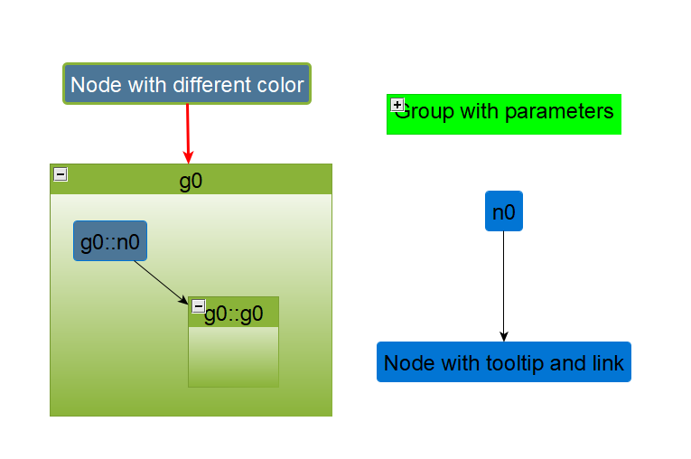

# python-graphml
A simple Python library to create .graphml files used for example by yEd

## Usage


```python
import pythonGraphml

graph = pythonGraphml.Graph()

graph.add_node("n0")
graph.add_node("n1", node_label="Node with tooltip and link", node_description="tooltip", node_url="this/is/an/url/")
graph.add_node("n2", node_label="Node with different color", node_color="#4C7697", node_border_color="#8AB339", node_border_width="3", node_label_color="#FFFFFF")

graph.add_group("g0")
graph.add_group("g1", group_label="Group with parameters", group_description="Tooltip", group_url="another/url/", group_color="#00FF00")

graph.add_edge("e0", "n0", "n1")
graph.add_edge("e1", "n2", "g0", edge_description="Text on edge", edge_color="#FF0000", edge_width="3")

graph.groups["g0"].add_node("n0", node_color="#4C7697")
graph.groups["g0"].add_group("g0")
graph.groups["g0"].add_edge("e0", "n0", "g0")

graph.write_graph("out.graphml")
```


